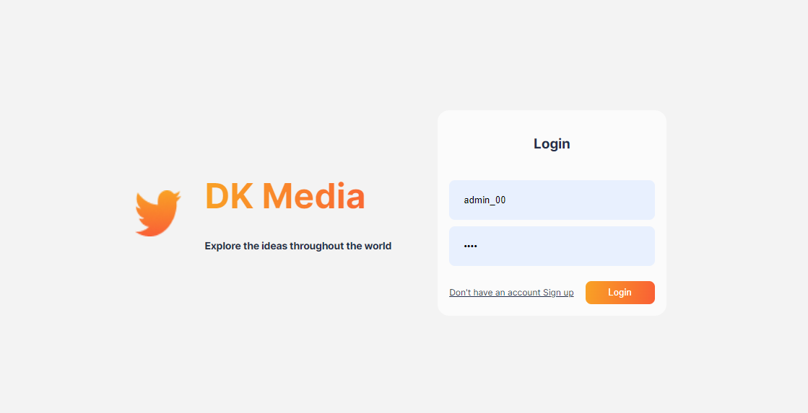
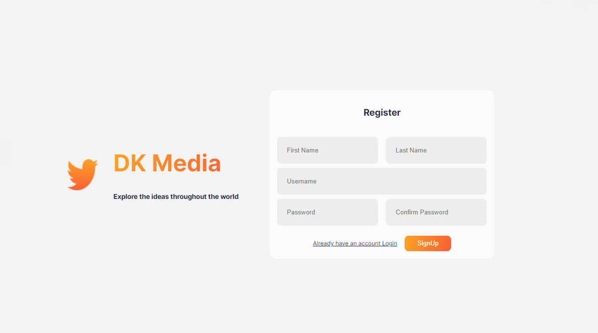
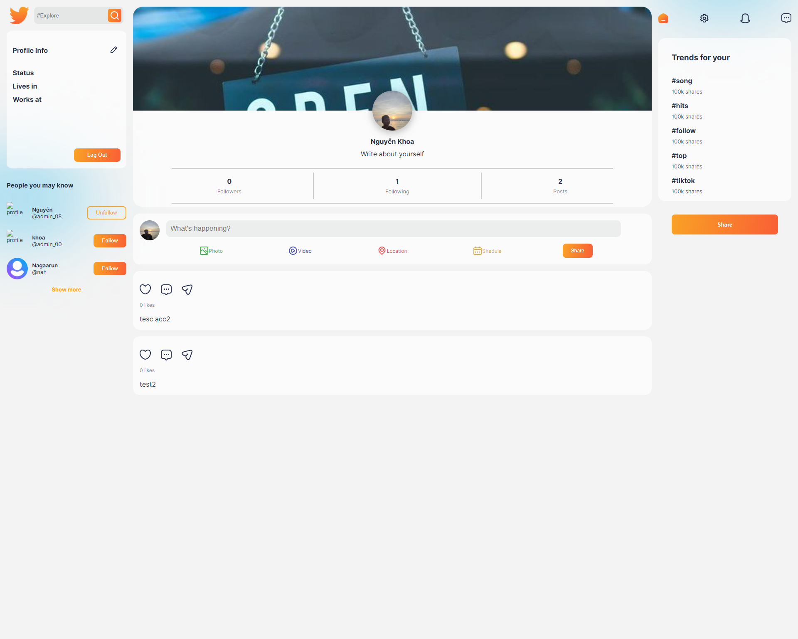
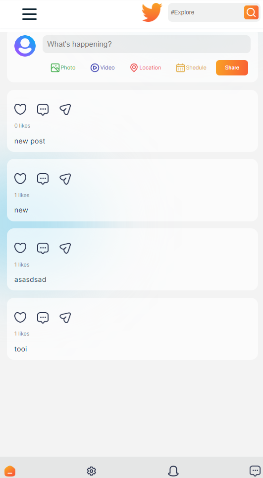
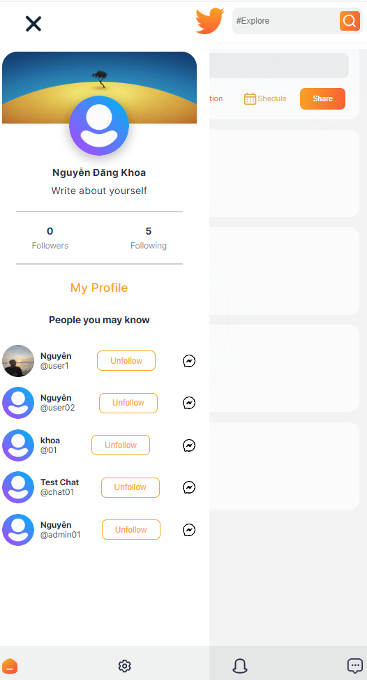

# SOCIALMEDIA FULLSTACK

> Fullstack website (MERN STACK).
> Live demo [_here_](https://social-media-fullstack.vercel.app/).

## Table of Contents

- [SOCIALMEDIA FULLSTACK](#socialmedia-fullstack)
  - [Table of Contents](#table-of-contents)
  - [Technologies Used](#technologies-used)
  - [Features](#features)
  - [Screenshots](#screenshots)
  - [Chat](#chat)
  - [Responsive](#responsive)
  - [Setup](#setup)
  - [Contact](#contact)

## Technologies Used

- ReactJS
- NodeJS, Express
- SocketIO

## Features

List the ready features here:

- Login, Register, JWT
- CRUD: Post, Edit Profile, reaction (like, follow...)
- Chat: web socket ==> Developing...

## Screenshots

<!-- If you have screenshots you'd like to share, include them here. -->

## Chat

## Responsive

<!-- If you have screenshots you'd like to share, include them here. -->

## Setup

CMD
`cd client`
`yarn install`
`yarn start`

open new terminal
`cd server`
`npm install` (setup mongodb)
`npm start`

open new terminal
`cd socket`
`npm install`
`npm start`

## Contact

Created by [@DangKhoa Nguyen](https://portfolio-khoa25200.vercel.app/) - feel free to contact me!
